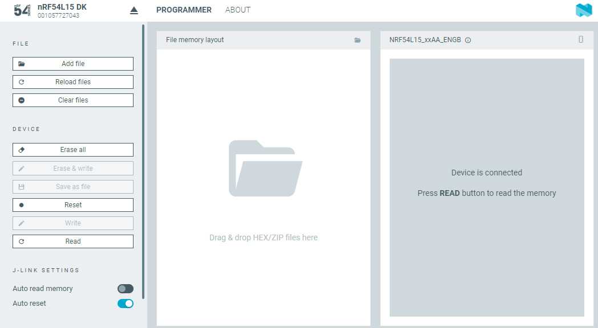
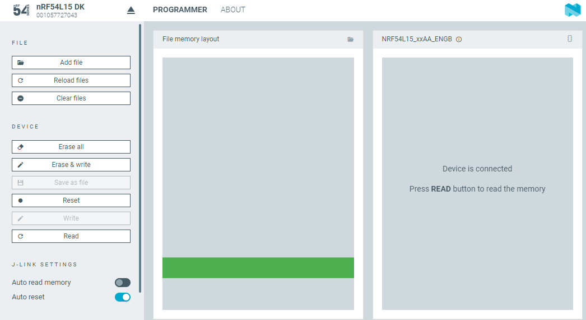

# Programming devices

In the Programmer app, you can program [supported devices](index.md#supported-hardware) or a custom board with a supported chip that allows for communication with J-Link, Nordic Secure DFU devices, and MCUboot devices.

!!! tip "Tip"
      If you experience any problems during the programming process, press Ctrl-R (command-R on macOS) to restart the Programmer app, and try programming again.

## Device-specific procedures

The following devices have specific programming requirements or procedures:

| Device                            | Description                                                                                                          |
|-----------------------------------|----------------------------------------------------------------------------------------------------------------------|
| nRF91 Series DK            | To program the nRF91 Series DK, see [Programming nRF91 Series DK firmware](programming_91dk.md). |
| Nordic Thingy:91 X     | To program Nordic Thingy:91 X, see [Programming Nordic Thingy prototyping platforms](programming_thingy.md).|
| Nordic Thingy:91      | To program Nordic Thingy:91, see [Programming Nordic Thingy prototyping platforms](programming_thingy.md).|
| Nordic Thingy:53      | To program Nordic Thingy:53, see [Programming Nordic Thingy prototyping platforms](programming_thingy.md). |
| Nordic Thingy:52      | Nordic Thingy:52 can be programmed using the [general programming procedure](#general-programming-procedure), but only through J-Link and a 10-pin programming cable. |
| nRF52840 Dongle       | To program the nRF52840 Dongle, see [Programming the nRF52840 Dongle](programming_nrf52840_dongle.md). |
| Custom board          | When programming a custom board with a supported chip, use the [general programming procedure](#general-programming-procedure), but make sure that the J-Link version is compatible with the relevant Arm® CPU. For example, an nRF52 Series DK cannot be used to program a Nordic Thingy:91 since the J-Link on an nRF52 Series DK does not support the programming of the Arm Cortex®-M33 CPU of Nordic Thingy:91. |

## General programming procedure

!!! note "Note"

      Do not unplug or turn off the device during programming.

To program a supported development kit, complete the following procedure:

1. Open nRF Connect for Desktop and launch the Programmer app.
1. Connect a development kit to the computer with a USB cable and turn it on.
1. Click **Select device**. 

    

    A drop-down menu appears.

1. Choose the device from the drop-down list. 
   The **Device Memory Layout** section indicates that the device is connected, like in the following image for the nRF54L15 DK. 

    

1. If you want to see the memory layout before you program, click **Read** in the menu. You can also select the **Auto read memory** option under the **Device** menu, so that the memory layout updates automatically.

    !!! note "Note"
         **Read** is not available for hardware that is using MCUboot.

1. Drag and drop the HEX file into the **File Memory Layout** section. Alternatively, click **Add file** to add the files you want to program, using one of the following options:

    - Select the files you used recently.
    - If there are no recently used files, click **Browse** from the drop-down list.

1. Select the firmware image file from the file browser that opens up; either a HEX file (in most cases) or a ZIP (when programming cellular modem firmware or multi-image programming with MCUboot). 
   The **File Memory Layout** section is updated for the selected file, like in the following image for the nRF54L15 DK. 

    

1. Depending on the device type and the programming method, use one of the following programming options in the **Device** panel:

    - **Erase & write** for J-Link
    - **Write** for MCUboot, Nordic Secure DFU, or modem firmware

   When programming starts, a progress bar appears.
